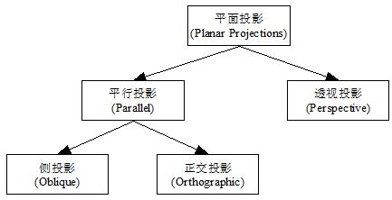
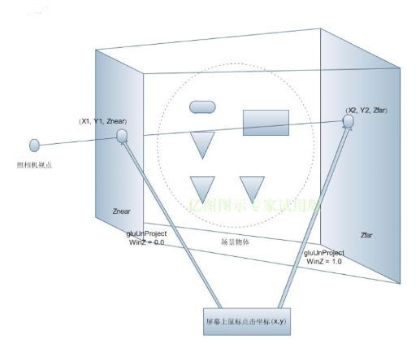

# 3D 知识

- QA
- 左手坐标系 & 右手坐标系
- 行向量 & 列向量
- 左乘 & 右乘
- 变换矩阵 （平移、旋转、缩放、投影、视图、模型）
- 投影
- 视图
- 自转 & 公转 （先旋转后平移是自转，而先平移后旋转是公转）
- 拾取 
- lifecycle

#### QA
```
1、左右坐标系 对 投影矩阵 的 影响
2、自转 、公转 操作
3、视图矩阵 有很多版本
```

#### 坐标系
- 右手坐标系-OpenGL使用, 左乘
- 左手坐标系-Direct3D使用


```

```

#### [坐标变换矩阵](https://wgld.org/d/webgl/w013.html)
- 模型转换矩阵 - 世界转换矩阵
- 视图转换矩阵 - 定义摄像机的位置，摄像机注视点，相机向上的方向
- 投影变换矩阵 - 定义屏幕的纵横比，剪裁区域等
```
第一个是模型转换矩阵，在DirectX和其他中也称为世界转换矩阵。顾名思义，模型转换矩阵会影响正在绘制的模型。所述的模型位置，模型旋转，模型缩放（缩放是具有关于信息）通常。

第二个是视图转换矩阵。要清楚地说这是为了定义一个拍摄3D空间的相机。摄像机的位置，摄像机注视点，相机向上的方向通过定义，以确定是否相机是如何表现到。

第三个是投影变换矩阵。此坐标转换定义屏幕的纵横比，剪裁区域等。您还需要此变换矩阵来获得透视效果。
```


#### [左乘与右乘](https://blog.csdn.net/miaomiaoyuan/article/details/54973363)
> 左乘”和“右乘”的区别，或者叫做“前乘（pre-multiply），后乘（post-multiply）
```
当三维坐标发生旋转、平移时，就需要考虑到矩阵是左乘还是右乘。 设有旋转矩阵R，平移矩阵T， 坐标矩阵A。

- 若是绕着静态的世界坐标系旋转，有RA，即左乘旋转矩阵 
- 若是绕着动态的自身坐标系旋转，有A’R’， 即右乘旋转矩阵 
- 若是进行平移，则有TA，即左乘平移矩阵， A’T’为右乘平移矩阵

在使用中，我们通常对三维点（云）的旋转与平移进行左乘。 而旋转矩阵在左乘时设逆时针为正。 

第一种形式（以右手坐标系为基准的）进行变换时将T与需要变换的点或向量A（列向量）相乘，即TA。
第二种形式（以左手坐标系为基准）将需要变换的点或向量（行向量）与T相乘，即AT。
```


#### 投影




#### [视图矩阵](https://www.web-tinker.com/article/20177.html)
> 视图矩阵就是觉得摄像机属性的矩阵, 生成视图矩阵时需要用到三个参数

- 移动属性 - 摄像机可以移动
- 镜头朝向属性 - 摄像机可以旋转镜头
- 顶部朝向属性 - 自传

```
1 默认的视线方向是(0,0,-1)
2 默认的上方向是(0,1,0)
3 右边是x轴的增加方向是(1,0,0)
```

#### 拾取

```
鼠标在屏幕上点击的时候，得到二维坐标p(x, y),再加上深度坐标的范围(0, 1), 就可以形成两个三位坐标A(x1, y1, 0), B(x2, y, 1), 由于它们的Z轴坐标是0和1，则转变到投影坐标系的话，一定分别是前剪切平面上的点和后剪切平面上的点，也就是说，在投影坐标系中，A点一定在能看见的所有模型的最前面，B点一定在能看见的所有的模型的最后边，将AB点连成线，AB线穿过的物体就是被点击的物体。而 Three.js提供一个射线类Raycasting来拾取场景里面的物体。更方便的使用鼠标来操作3D场景。（不过在实际代码中我们组成射线的两个点是摄像机所在视点与屏幕上点击的点连接而成的射线）
```

模型空间 –>( 模型矩阵) –> 世界空间 –> （视图矩阵） –> 观察空间（摄像机，右手坐标系，其余均采用左手） –> （投影矩阵） –> 裁剪空间 –> 屏幕空间，每一次变换都对应着相应的矩阵。
世界坐标系->相机坐标系->投影坐标系->屏幕坐标系
```
引进相机的目的就是只需看到世界的一部分，而哪些是可以在相机里看到的，就需要进行筛选。将物体转换到相机坐标系，这样相机坐标系进行筛选时就会简单很多。这里的重点是构建相机坐标系。


我们知道,旋转矩阵是个正交矩阵，它的逆矩阵和转置矩阵一样得到下面
```

https://wgld.org/s/sample_005/

RH
LH
[图形变换之基本矩阵变换](https://www.cnblogs.com/ll-10/p/5470637.html)
```
首先必须将原始的右手坐标系中的数据转换为左手坐标系中的数据，位置(Location)与位移(Translation)转换也比较简单，将X,Y,Z中的任意一个值取反即可。
旋转比较麻烦，需要借助一个矩阵，直接上公式：
//右手坐标系下旋转 RR，那么左手坐标系下的旋转LR应为
	Matrix M = {
      1,0,0,0
			0,-1,0,0
			0,0,1,0
			0,0,0,1};
	LR = M*RR*M;

矩阵M很像一个单位矩阵，但是他不是，它的第二行有一个-1，这是转换的关键，其实将单位矩阵中的任何一个1变成-1，但是，一定要和Location,Translation取反的值一致，也就是说，如果Location是Y轴取反，那么矩阵M一定要是第二行为-1，其他两个轴同理，要对应起来。

另外，以上是右手转左手，左手转右手也是同样的道理。

而行列向量与矩阵的乘法代表的是变换，只要是在一个坐标系下的变换，用行和列得到的结果是一样的，左右手坐标系会影响view矩阵和project矩阵的计算
左右手坐标系与行列向量之间没有直接关系，但是两者共同影响了view矩阵和project矩阵的构建，用view矩阵举例,左右手影响up，right，forward向量的计算，而行列向量影响up等三个向量在矩阵中的排布方式

https://www.cnblogs.com/ll-10/p/5470637.html： 左右坐标系下，T、R 表示

第一种形式（以右手坐标系为基准的）进行变换时将T与需要变换的点或向量A（列向量）相乘，即TA。第二种形式（以左手坐标系为基准）将需要变换的点或向量（行向量）与T相乘，即AT。
OpenGL使用的是右手坐标系,而Direct3D使用的是左手坐标系
```

#### coordinated system
MVP也即是 模型（M）、视图（V）、透视（P）三个单词的首字母简写。

- Object (M)
- Camera (V) 摄像机坐标系
- screen (P) 世界坐标系

MVP = P * V * M
http://www.manew.com/blog-22490-660.html
正射投影和透视投影。前者用于精确制图，如工业零件侧视图或建筑物顶视图，从屏幕上就可以量测平行于屏幕的线段长度；后者用于模拟视觉，远处的物体看上去较小
视图矩阵实际上就是整个世界的模型矩阵
模型视图矩阵的作用是确定某一帧中，空间里每个顶点的坐标，而投影矩阵则将这些顶点坐标映射到二维的屏幕上

M: ModelMatrix 模型矩阵，表示物体的 平移、缩放、旋转 变换信息 - 
```
所谓的ModelMatrix，就是将模型坐标变换到WorldMatrix的Matrix，

WorldMatrix = Mt * Mr * Ms

Vw = WorldMatrix * Vm
```
V: ViewMatrix 用于直接将World坐标系下的坐标转换到Camera坐标系下
```
视图矩阵作用一句话简明表达就是世界坐标系转换到摄像机坐标系。
1、根据摄像机的位置和旋转信息可以构造出摄像机的坐标系矩阵C-你单纯的乘上世界矩阵，是错误的。因为你的变化还是在世界坐标系做平移和旋转。
2、

一 相机状态描述
视点：相机在世界坐标中的位置 eye(eyeX, eyeY, eyeZ)
观测点：被观察的目标点，指明相机的朝向 at(atX, atY, atZ)
视线：从视点出发指向观测点方向的射线 dir(atX - eyeX, atY - eyeY, atZ - eyeZ)
上方向：图像的上方向，指明相机以视线为轴的旋转角 up(upX, upY, upZ)

二 相机坐标系
定义： 以视点为原点，以视线为z轴负方向，x轴与y轴与图像的x,y轴平行。
根据定义，首先可得出：

zAxis：-dir = eye - at = (eyeX - atX, eyeY - atY, eyeZ - atZ) 归一化 N(Nx, Ny, Nz)
xAxis：up X zAxis 归一化 U(Ux, Uy, Uz)
yAxis: zAxis X xAxis 归一化 V(Vx, Vy, Vz)
三 视图矩阵
姿态矩阵：相机位置变化矩阵。
视图矩阵：将顶点有世界坐标系转到到相机坐标系下的变化矩阵。
当相机位置变化时，可以看作相机不动，被观测物体发生相反的，所以视图矩阵即为姿态矩阵的逆矩阵。
假设相机初始坐标系与世界坐标重合，然后一个旋转变化R，然后经过一个平移变换T，得到相机坐标系。
```
P
```
```

[1](https://blog.csdn.net/u012419410/article/details/41980895)
[2](https://blog.csdn.net/xufeng0991/article/details/75949931)
[3](https://blog.csdn.net/zb1165048017/article/details/71104241)
[4](https://www.cnblogs.com/wbaoqing/p/5422974.html)
[5](https://www.cnblogs.com/ll-10/p/5470637.html)
[6](http://www.cnblogs.com/shanhaobo/articles/1065380.html)
[7](https://www.cnblogs.com/edwardloveyou/p/8120533.html)